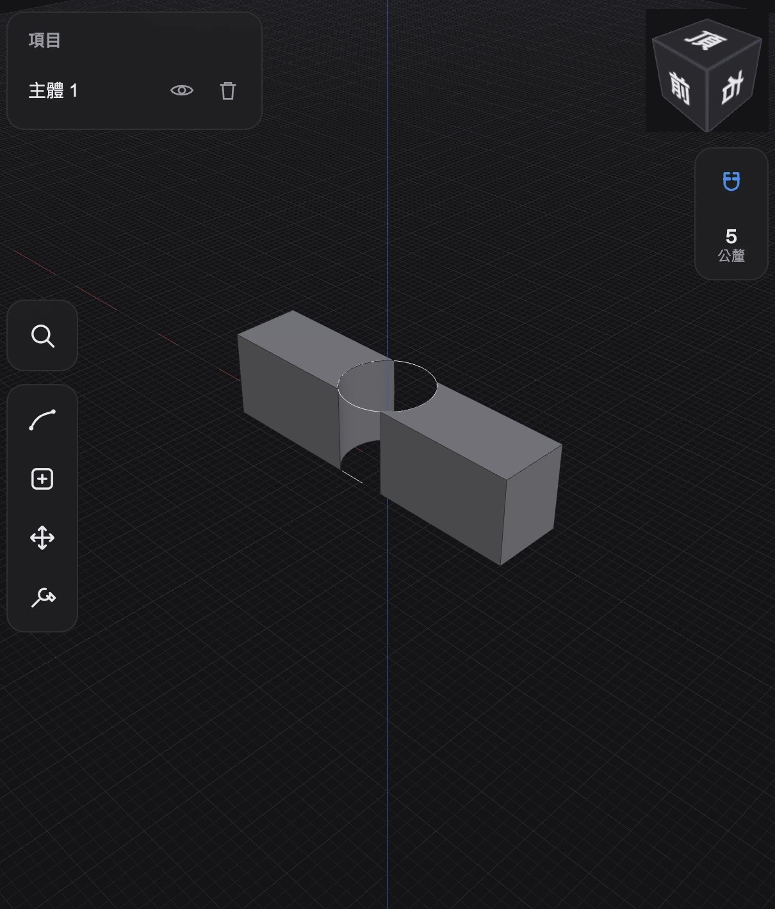
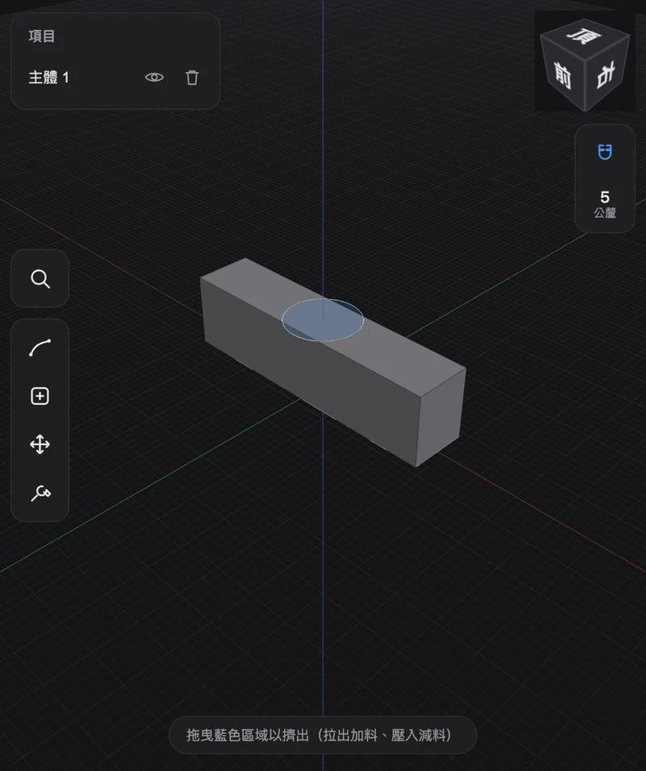

# HephCAD



**Open-source, iPad-first CAD. Sketch on a face, pull to add material, push to cut. That's it — that's the app.**

HephCAD is an attempt to build the tablet CAD experience people love — direct modeling with your fingers and an Apple Pencil — as an open-source web app. Real B-rep solids powered by OpenCascade compiled to WebAssembly, running entirely in your browser. No install, no account, no cloud.

The signature interaction already works today:

1. Tap the sketch tool and draw a rectangle on the ground grid.
2. Tap ✓ — the closed region glows blue.
3. Drag it upward. A solid plate grows under your finger.
4. Tap the plate's top face, sketch a circle on it, tap ✓.
5. Push the circle down — it cuts a clean hole straight through.



Five gestures, zero dialogs, and you're holding a real boundary-representation solid that will export to STEP one milestone from now. The hole in the plate at the top of this page was made exactly this way.

## Why this exists

Serious CAD is either closed-source, desktop-bound, or too intimidating to touch. Tablet CAD proved that direct modeling can feel effortless — but nobody has built that experience in the open. HephCAD is trying, with a deliberately narrow path:

- **iPad and touch first.** One finger draws and pulls, two fingers navigate. Every target is finger-sized.
- **Real B-rep, not mesh sculpting.** OpenCascade (OCCT) as the geometry kernel, compiled to WASM and isolated in a Web Worker — the UI never blocks, and a kernel crash can't take down the app.
- **Web/PWA delivery.** Open a URL on your iPad and start modeling. Native shell only if it ever earns its keep.
- **Small, verifiable milestones.** Every feature lands with acceptance criteria and tests. Architecture decisions get an ADR before big dependencies get added.

## What works today (M0–M5)

- **Viewport**: Z-up turntable camera tuned for touch (one-finger orbit, two-finger pan, pinch zoom, inertia-damped view snapping), ViewCube, adaptive dark CAD grid.
- **Kernel channel**: OCCT WASM in a Web Worker with a typed message protocol; tessellation moves via zero-copy transferables; every face/edge carries a topology index for picking.
- **Selection**: tap for faces/edges (with screen-space tolerance so thin edges are actually tappable), double-tap for bodies, accumulating multi-select, items panel with visibility and delete.
- **Sketching**: draw on the ground plane or any planar face. Line, rectangle, circle, and a two-stroke arc designed for touch (pull the chord, then pull the bulge). Snapping to endpoints, midpoints, centers, horizontal/vertical alignment, and the grid.
- **Closed regions**: detected live via OCCT planar-graph analysis and filled translucent blue — including regions formed by overlapping curves.
- **Drag extrusion with automatic booleans**: pull a region to fuse, push into the host body to cut. The drag preview is a pure-JS ghost prism, so it never waits on the kernel; the real boolean commits on release.
- **Documents & history**: every geometry change goes through a linear operation journal — unlimited undo/redo (⌘Z / ⇧⌘Z or the history panel), with each op self-contained enough to replay the whole model deterministically.
- **Autosave**: the journal persists to OPFS (localStorage fallback) and your model is rebuilt exactly where you left it on next launch.
- **STEP import/export**: bring real CAD files in, send real CAD files out.
- 64 unit tests across camera math, gestures, picking, sketch geometry, snapping, tools, extrusion, and the document journal.

## Future work

Near-term milestones (roughly in order):

- **M6 — Modify tools**: move/rotate/copy with a touch gizmo, drag-to-fillet/chamfer on edges, shell, offset face — with graceful, undoable failure when OCCT says no.
- **M7 — Polish**: measurement, section views, appearance/materials, installable PWA with offline support, adaptive tessellation for large models, i18n (English + 繁體中文), sketch-axis screen alignment.
- **M8 — Open-source hardening**: contributor docs, live demo site, and a custom-trimmed OCCT WASM build (the current full build is 14 MB gzipped; we can cut that dramatically).

Beyond the milestones, the fun stuff:

- Sketch dimensions and lightweight constraints (Shapr3D-style, not a full constraint solver).
- Revolve, sweep, and loft; parametric helix/thread generators.
- Numeric input during any drag (type "25" while extruding).
- Persistent topological naming across boolean operations — the famous hard problem; our journal-based scope makes a pragmatic solution feasible.
- Apple Pencil pressure/hover affordances, reference images, WebGPU rendering.
- A native shell (WKWebView) if PWA limits ever bite.

## Tech stack

TypeScript · Vite · React (panels only — the viewport is imperative Three.js) · Zustand · OpenCascade via `opencascade.js` in a Web Worker · Vitest + ESLint + GitHub Actions.

Architecture decisions live in [docs/adr](docs/adr) — start with [0001 (why Web+WASM)](docs/adr/0001-web-wasm-stack.md) and [0004 (viewport/React boundary)](docs/adr/0004-viewport-react-boundary.md).

## Run it locally

```bash
npm install
npm run dev        # then open http://localhost:5173
```

For iPad testing, the dev server binds to your LAN — open `http://<your-mac-ip>:5173` from the iPad. First load fetches the 14 MB WASM kernel; after that it's instant.

Checks: `npm run test` · `npm run lint` · `npm run typecheck` · `npm run build`

## Contributing

This project is small enough that one person can still hold the whole architecture in their head — which makes it a great time to jump in. Areas where help moves the needle most:

- **Touch/Pencil UX**: you have an iPad and opinions about how CAD should feel? Test the sketch→extrude flow and file issues about anything that feels off.
- **OCCT from WASM**: booleans, fillets, STEP I/O, and the dark art of a trimmed Emscripten build.
- **Sketch engine**: constraint-light 2D editing, better snapping, dimension input.
- **Rendering**: picking performance, highlight styles, section views, WebGPU.
- **Topology mapping**: stable face/edge identity across operations (see [ADR 0002](docs/adr/0002-topology-id-mapping.md)).

Ground rules are short: keep changes small and verifiable, write acceptance criteria before features, and add an ADR before architectural or dependency-heavy choices. The codebase is strictly layered (pure math → kernel worker → viewport → React), and every pure layer has tests you can copy as a template.

## License

MIT. See [LICENSE](LICENSE).
