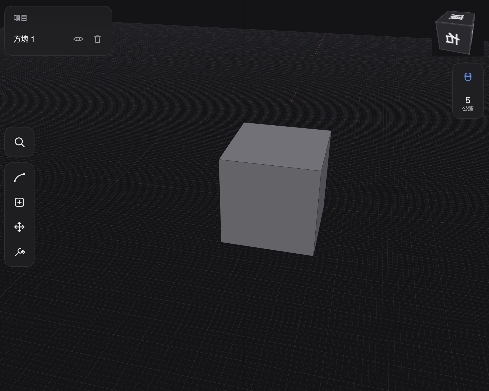

# HephCAD



HephCAD is an open-source, iPad-first B-rep CAD experiment.

The goal is a touch and Apple Pencil friendly direct modeling app: sketch on a face, drag to extrude, and let the kernel handle clean B-rep operations. Think of the core workflow people expect from modern tablet CAD, but built in the open and kept small enough that contributors can actually move it forward.

This repo restarted on 2026-07-03. The current codebase is a Web/WASM implementation using TypeScript, React, Three.js, and OpenCascade compiled to WebAssembly.

## Why This Exists

Most CAD projects are either closed, desktop-first, or too large to approach casually. HephCAD is trying a narrower path:

- iPad and touch-first interaction.
- B-rep modeling first, not mesh sculpting.
- Web/PWA delivery before native app complexity.
- Small milestones with visible, testable progress.
- Architecture decisions documented before big dependencies or rewrites.

This is not production CAD yet. It is a working foundation looking for people who want to help make open tablet CAD real.

## Current Status

Implemented:

- Three.js viewport with dark CAD grid.
- Touch/mouse camera controls.
- ViewCube standard orientation switching.
- OCCT WebAssembly worker path.
- Primitive body creation and tessellation.
- Face, edge, and body picking.
- Selection highlighting.
- Items panel with visibility/delete controls.
- Sketch mode on planar faces or the ground plane: line, rectangle, circle, and two-stroke arc tools.
- Snapping (endpoint, midpoint, center, horizontal/vertical alignment, grid) with visual snap markers.
- Closed-region detection via OCCT planar graph analysis, with translucent region fill (regions are kept in the kernel for extrusion).
- Unit tests for camera, gestures, picking, sketch math, snapping, tools, and state.

Next milestones:

- Drag extrusion with automatic boolean behavior.
- Journal-based undo/redo.
- OPFS autosave and document format.
- STEP import/export.
- Fillet, chamfer, shell, move/copy, offset face.
- PWA polish for real iPad use.

## Tech Stack

- TypeScript
- Vite
- React
- Three.js
- OpenCascade via `opencascade.js`
- Web Worker kernel boundary
- Zustand state
- Vitest and ESLint

Architecture notes live in [docs/adr](docs/adr).

## Run Locally

```bash
npm install
npm run dev
```

Useful checks:

```bash
npm run test
npm run lint
npm run typecheck
npm run build
```

For iPad testing, run the dev server with host access and open it from the same network:

```bash
npm run dev -- --host
```

## Contributing

Help is especially useful in these areas:

- Sketch plane math and constraint-light 2D editing.
- OCCT B-rep operations from WebAssembly.
- Robust topology id mapping across operations.
- Touch/Pencil UX design for CAD workflows.
- Three.js rendering and picking performance.
- iPad PWA testing.
- Documentation, examples, and small reproducible acceptance tests.

Please keep changes small and verifiable. If a design choice is architectural or dependency-heavy, add an ADR first.

## Project Direction

HephCAD is intentionally scoped:

- B-rep first.
- Meshes are for import, view, or conversion, not mesh editing.
- No full history tree in the first version.
- No cloud, auth, or collaboration in the first version.
- Reference images matter for MVP workflows.
- Helix, spring, and thread features should be parametric generators, not freeform sculpting tools.

## License

MIT. See [LICENSE](LICENSE).
