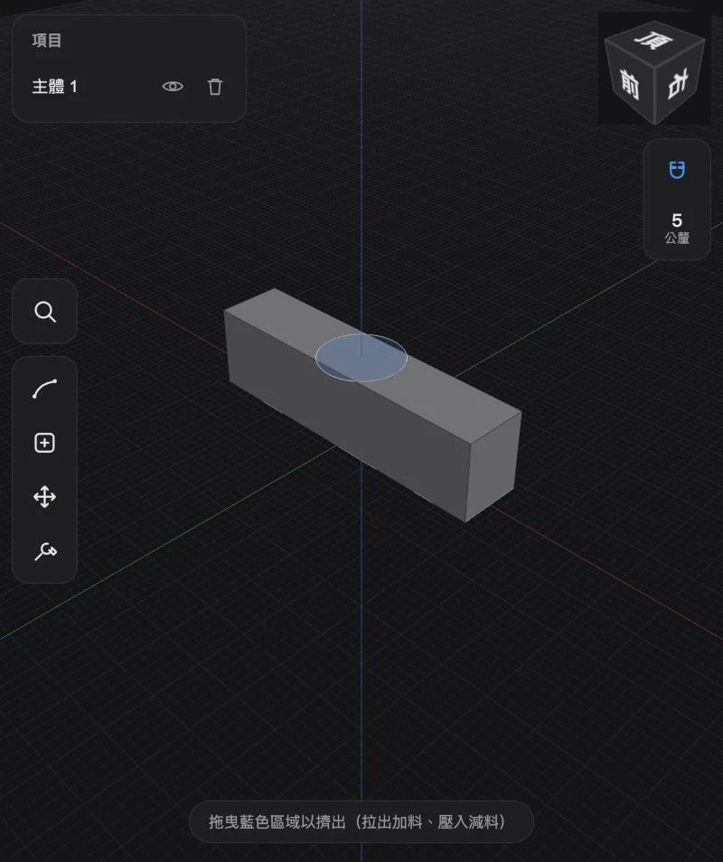
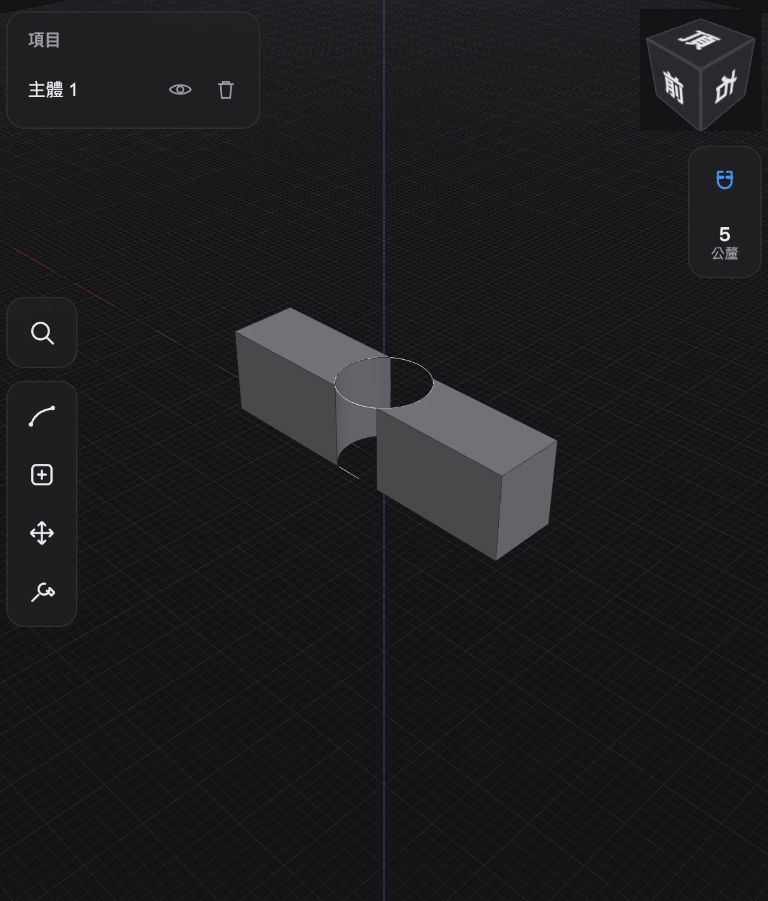
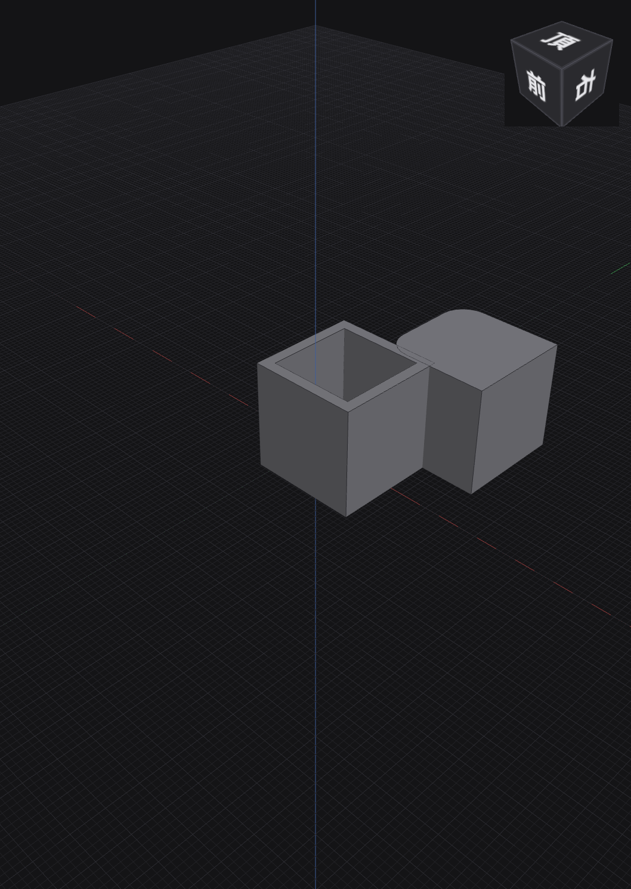

# HephCAD



**Open-source, iPad-first CAD. Sketch on a face, pull to add material, push to cut. That's it — that's the app.**

HephCAD is an attempt to build the tablet CAD experience people love — direct modeling with your fingers and an Apple Pencil — as an open-source web app. Real B-rep solids powered by OpenCascade compiled to WebAssembly, running entirely in your browser. No install, no account, no cloud.

**▶ Try it: [hysus12.github.io/HephCAD](https://hysus12.github.io/HephCAD/)** — best in Safari on an iPad. Tap Share → *Add to Home Screen* and it works offline after the first load.

The signature interaction already works today:

1. Pick up the Pencil and draw a rectangle on the ground grid — no mode to enter, the pen just draws.
2. Tap inside it. The closed region glows blue and an arrow appears.
3. Drag the arrow up. A solid plate grows under the pen, with a live dimension.
4. Draw a circle right on the plate's top face.
5. Tap the circle and drag its arrow down — it cuts a clean hole straight through. Tap the dimension to type an exact depth.

The Pencil draws and selects; your fingers orbit, pan, and zoom; a two-finger tap undoes. That split is the whole interaction model.



Five steps, zero dialogs, and you're holding a real boundary-representation solid that exports straight to STEP. The plate above went from the blue region at the top of this page to a clean through-hole exactly this way.

## Why this exists

Serious CAD is either closed-source, desktop-bound, or too intimidating to touch. Tablet CAD proved that direct modeling can feel effortless — but nobody has built that experience in the open. HephCAD is trying, with a deliberately narrow path:

- **iPad and touch first.** One finger draws and pulls, two fingers navigate. Every target is finger-sized.
- **Real B-rep, not mesh sculpting.** OpenCascade (OCCT) as the geometry kernel, compiled to WASM and isolated in a Web Worker — the UI never blocks, and a kernel crash can't take down the app.
- **Web/PWA delivery.** Open a URL on your iPad and start modeling. Native shell only if it ever earns its keep.
- **Small, verifiable milestones.** Every feature lands with acceptance criteria and tests. Architecture decisions get an ADR before big dependencies get added.

## What works today (M0–M7)

- **Pencil-first input**: the Pencil draws, selects, and drags handles; fingers orbit, pan, and pinch-zoom; two-finger tap undoes and three-finger tap redoes. Palm rejection ignores touches while the pen is down or was just active (hover included). Mouse and keyboard work too (right-drag orbits, V/L/A/R/C pick tools, Esc, Delete, ⌘Z).
- **Viewport**: Z-up turntable camera, inertia-damped view snapping, ViewCube, adaptive dark CAD grid.
- **Kernel channel**: OCCT WASM in a Web Worker with a typed message protocol; tessellation moves via zero-copy transferables; every face/edge carries a topology index for picking.
- **Selection**: tap sketch lines, regions, faces, or edges (screen-space tolerance so thin edges are actually tappable), double-tap for a whole body or sketch, accumulating multi-select, items panel with visibility and delete for bodies and sketches.
- **Modeless sketching**: no sketch mode. Where the pen lands decides the plane — an existing sketch, a planar face, or the ground. Line, rectangle, circle, and a two-stroke arc designed for touch (pull the chord, then pull the bulge). Snapping to endpoints, midpoints, centers, horizontal/vertical alignment, the grid — and the model's own corners and edge midpoints when drawing on a face. A hover cursor previews where the pen will snap.
- **Sketches are part of the document**: every stroke is its own undo step, survives reloads, and lines can be selected and deleted. Overlapping shapes on the same plane cut each other into separate regions, detected live via OCCT planar-graph analysis.
- **Arrow handles**: select a region, a planar face, a body, or edges and an arrow appears — drag it to extrude, push/pull, move along X/Y/Z, or set a fillet/chamfer. Pulling adds material; pushing into a body cuts (the preview turns red). The drag preview is a pure-JS ghost, so it never waits on the kernel; the real boolean commits on release, and merges coplanar faces so there are no seams.
- **Exact numbers**: dimensions follow the pen while you draw and drag (1 mm steps with snap on); tap the label afterwards to type an exact value that replaces that step.
- **Documents & history**: every change goes through a linear operation journal — unlimited undo/redo (two-finger tap, ⌘Z, or the history panel), with each op self-contained enough to replay the whole model deterministically.
- **Autosave**: the journal persists to OPFS (localStorage fallback) and your model is rebuilt exactly where you left it on next launch.
- **STEP import/export**: bring real CAD files in, send real CAD files out.
- **Modify tools**: select a body and a context bar appears — move it with three axis arrows or copy it. Select edges and drag the orange arrow to fillet or chamfer with a live kernel preview; select a face to push/pull it or shell the body open. Kernel failures (radius too big, wall too thick) degrade gracefully and never corrupt the journal.

  
- **Measurement built into selection**: pick an edge and see its length, a face its area, a body its volume — no separate measure tool.
- **Section view**: one tap slices the model at its center so you can see inside (no cap faces yet).
- **Installable PWA**: the service worker precaches the whole app including the 50 MB kernel — second launch on iPad is instant and fully offline.
- **Crash-proof kernel**: if the WASM kernel aborts (say, out of memory on an iPad), in-flight requests fail fast, the worker restarts, and your model is replayed from the in-memory journal in a few seconds. Ops that no longer succeed on replay are skipped and flagged in the history panel instead of losing the whole document.
- 114 unit tests across gestures and palm rejection, picking, sketch geometry and derivation, snapping, tools, dimensions, mesh-derived face geometry, extrusion, the document journal, and kernel crash recovery.

> **Honest status:** the Pencil-first interaction was reworked recently and verified with simulated pen/touch events in a browser, not yet on real iPad hardware. Palm-rejection timing, handle sizes, and hover are the likeliest things to need tuning — if you have an iPad and a Pencil, your feedback is the most valuable contribution right now. See [docs/HANDOFF.md](docs/HANDOFF.md) for exactly what is and isn't verified.

## Future work

Near-term milestones (roughly in order):

- **M6.5 — Modify tools, part 2**: rotation, offset face, multi-body move, keeping selection alive across modifications.
- **M7.5 — Polish, part 2**: draggable section plane with cap faces, appearance/materials, adaptive tessellation for large models, i18n (English + 繁體中文), a first-run tutorial card.
- **M8 — Open-source hardening**: ~~contributor docs~~ and ~~live demo site~~ are done; next is a custom-trimmed OCCT WASM build (the current full build is 14 MB gzipped). Off-the-shelf trimmed builds turned out to lack bindings we depend on — [ADR 0005](docs/adr/0005-trimmed-occt-wasm.md) has the evaluation, the exact symbol list, and the acceptance checks. A great self-contained project if you know Emscripten.

Beyond the milestones, the fun stuff:

- Editable sketch dimensions on any line, arc, or rectangle side, and lightweight constraints (Shapr3D-style, not a full constraint solver). Today only the last-drawn line or circle can be retyped.
- Revolve, sweep, and loft; parametric helix/thread generators.
- Typing a number *while* dragging (today you tap the label after releasing).
- Persistent topological naming across boolean operations — the famous hard problem; our journal-based scope makes a pragmatic solution feasible.
- Apple Pencil pressure and double-tap/squeeze gestures, reference images, WebGPU rendering.
- A native shell (WKWebView) if PWA limits ever bite.

## Tech stack

TypeScript · Vite · React (panels only — the viewport is imperative Three.js) · Zustand · OpenCascade via `opencascade.js` in a Web Worker · Vitest + ESLint + GitHub Actions.

Architecture decisions live in [docs/adr](docs/adr) — start with [0001 (why Web+WASM)](docs/adr/0001-web-wasm-stack.md) and [0004 (viewport/React boundary)](docs/adr/0004-viewport-react-boundary.md).

## Run it locally

```bash
npm install
npm run dev        # then open http://localhost:5173
```

For iPad testing, the dev server binds to your LAN — open `http://<your-mac-ip>:5173` from the iPad. First load fetches the 50 MB WASM kernel (14 MB compressed on the demo site); after that it's cached.

Checks: `npm run test` · `npm run lint` · `npm run typecheck` · `npm run build`

## Contributing

This project is small enough that one person can still hold the whole architecture in their head — which makes it a great time to jump in. Start with **[docs/architecture.md](docs/architecture.md)** (the pen/finger input model, how a sketch-and-extrude flows through every layer, plus a recipe for adding a new operation) and **[CONTRIBUTING.md](CONTRIBUTING.md)**. Areas where help moves the needle most:

- **Touch/Pencil UX**: you have an iPad and opinions about how CAD should feel? Try the draw → tap → drag-the-arrow flow and file issues about anything that feels off — especially palm touches, tiny handles, and missed taps.
- **OCCT from WASM**: booleans, fillets, STEP I/O, and the dark art of a trimmed Emscripten build.
- **Sketch engine**: constraint-light 2D editing, better snapping, dimension input.
- **Rendering**: picking performance, highlight styles, section views, WebGPU.
- **Topology mapping**: stable face/edge identity across operations (see [ADR 0002](docs/adr/0002-topology-id-mapping.md)).

Ground rules are short: keep changes small and verifiable, write acceptance criteria before features, and add an ADR before architectural or dependency-heavy choices. The codebase is strictly layered (pure math → kernel worker → viewport → React), and every pure layer has tests you can copy as a template.

## License

MIT. See [LICENSE](LICENSE).
